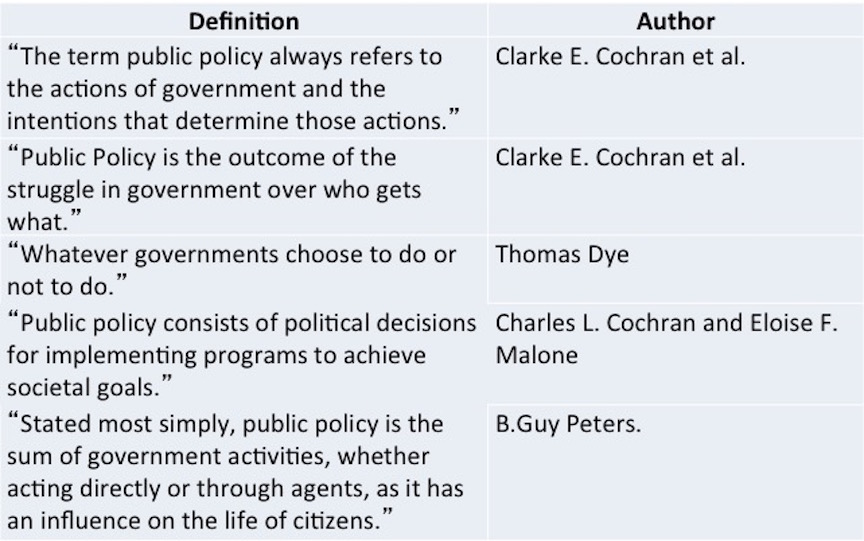

## Public Policy

### Definitions 

###

* These definitions share ideas that:
    * Policy responds to a problem 
    * The policy is made in the "public’s" behalf
    * Policies have goals 
    * Policies are made by governments
    * Policies are implemented by public and private actors
    * Policy can be action or inaction
 
