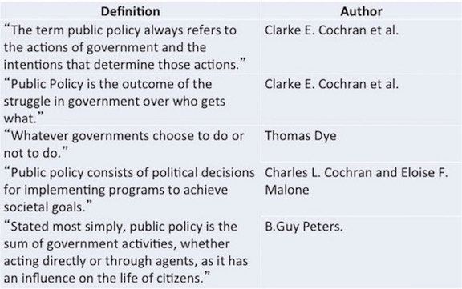

## Be Prepared for Class

## Public Policy

### Definitions 

### Shared Ideas 

* Policy responds to a problem 
* The policy is made in the "public’s" behalf
* Policies have goals 
* Policies are made by governments
* Policies are implemented by public and private actors
* Policy can be action or inaction
 
### Making Policy

* Institutions: _Public policy is authoritatively determined, implemented, and
    enforced by government institutions_
    * Congress, the presidency, courts, bureaucracies, states
    * Government institutions give public policy three distinctive
    characteristics:
        * 

* Macro Process:
    * Multiple institutions
    * Pluralism
    * Policy cycle (stages)
