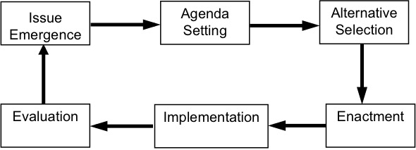

.left-column[
# Be Prepared for Class
]
.right-column[

]

---

# Environmental Policy
<!-- layzer pg 1 -->

* _Environmental policy conflicts almost always concern fundamental differences in values_

* _The way problems are defined and solutions depicted plays a central role in shaping how those values get translated into policies_

* What else might be unqiue about environmental policy? 

---

## Public Policy

### Definitions 

---

### Shared Ideas 

* Policy responds to a problem 
* The policy is made in the "public’s" behalf
* Policies have goals 
* Policies are made by governments
* Policies are implemented by public and private actors
* Policy can be action or inaction

---

### Forms of Policy

* Constitutional provisions
* Laws 
* Regulations
* _It is expressed in goals articulated by political leaders; in
  formal statutes, rules, and regulations; and in the practices of
  administrative agencies and courts charged with implementing or
  overseeing programs_ (Kraft and Vig)

---

### Making Policy: Institutions 

* Institutions: _Public policy is authoritatively determined, implemented, and
    enforced by government institutions_
    * Congress, the presidency, courts, bureaucracies
    * Government institutions give public policy three distinctive
    characteristics:
        * Legitimacy: legal obligations; democratic; the Constitution
        * Universality: extends to all citizens 
        * Coercion: imprison violators 

* _Government institutions provide structure to the process of policymaking_ 

---

### Making Policy: Major Policy Actors 

* Policy actors: _Those involved in the policymaking process that
  seek to see their preferences for policy enacted_

   

<body>
<table border="1">
<tr>
<th>Inside Government</th>
<th>Outside Government</th>
</tr>
<tr>
<td>Legislative actors</td>
<td>Advocacy organizations</td>
</tr>
<tr>
<td>Administrators</td>
<td>Experts</td>
</tr>
<tr>
<td>The Judiciary</td>
<td>The media</td>
</tr>
<tr>
<td>State and local</td>
<td> </td>
</tr>
</table>
</body>

---

### Policymaking Process

---

### Policymaking System

---

## Clash of Values

### What Vaules?

* Environmentalists vs. Cornucopians

* What other values or worldviews might impact views about the environment?

---

### Clashes Over Policy

* How do value clashes play out in environmental policy?
    * Defining problems 
    * Science 
    * Economics 
    * Risks

