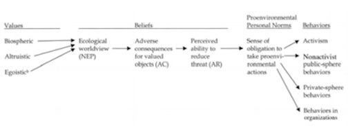
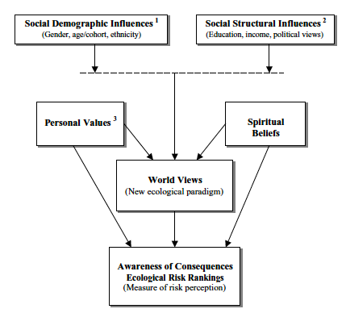
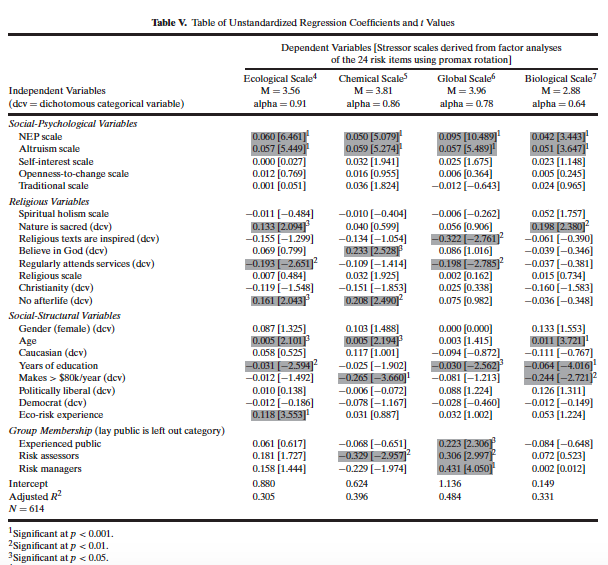
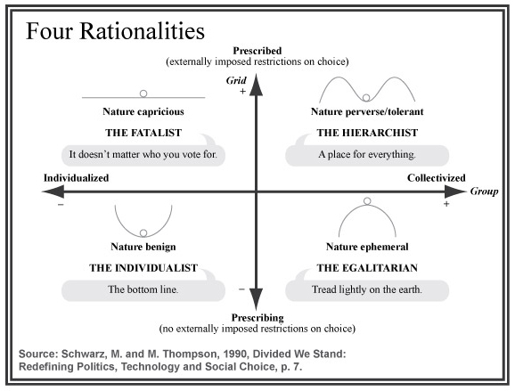
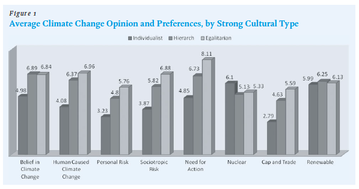

## Values

* Values: _Our philosophies about morality, justice, and ethics_ 

* _Environmental policy conflicts almost always concern fundamental
  differences in values_ 

* _Value conflicts are largely over the appropriate relationship between humans and natural world_ 

* However, value--based arguments are rarely made. Why? 

* How do value clashes play out in environmental policy?

---

### What Values?

* Political Ideology: _The set of underlying orientations, ideas, and beliefs through which people understand and interpret politics_
    * Liberal vs. Conservative

* Environmental Values: _Humans and the nature world_
    * Environmentalists vs. Cornucopians

* What other values or worldviews might impact views about the environment?

---

#### Environmentalists

* Early environmental values: _Preservation_ and _Conservation_

* Preservationist: Preserve and protect nature for its own sake
    * _The tendency nowadays to wander in wilderness is delightful to
see. Thousands of tired, nerve-shaken, over-civilized people are
beginning to find out that going to the mountains is going home; that
wilderness is a necessity; and that mountain parks and reservations
are useful not only as foundations of timber and irrigating rivers,
but as foundations of life._ (John Muir)

* Conservation: Prudent use of natural resources
    * _The object of our forest policy is not to preserve the forests because
they are beautiful . . . or because they are refuges for the wild
creatures of the wilderness. The forests are to be used by man. Every
other consideration comes secondary_ (Gifford Pinchot)
    
---

* Modern environmental values

* Conservation: _Contains strands of traditional preservationist and conservation ideas_

* Ecology: _System based on interdependence and stability_
    * Pollution
    * Protecting biological diversity

* Sustainability: [EPA website on sustainability](http://www.epa.gov/sustainability/)
    * _Creates and maintains the conditions under which
    humans and nature can exist in productive harmony, that permit
    fulfilling the social, economic and other requirements of present
    and future generations_ 
    * Unregulated markets lead to the "tragedy of the commons"

---

#### Cornucopians

* Cornucopians and the _Dominant Social Paradigm_
    * Emphasis on economic growth
    * Environmental restrictions limit economic well--being
    * High confidence in technological solutions
    * Individual liberty
        * Environmentalists are "watermelons"

* Dominant Social Paradigm and Environmental Policy
    * Free market economics
    * Science and technology
    * Separation from the natural environment

---

#### Value-Belief-Norm

* _New Ecological Paradigm_
    * For more see [Dunlap et al (2000)](http://academic.evergreen.edu/s/smitht/NEP%20Revised%20study%202000.pdf)
---

---

---

#### Cultural Theory 

* Cultural Theory (CT) presents a way of understanding value systems based on cultural bias, social relations, and ways of life
    * Cultural bias: _Shared values and beliefs_
    * Social relations: _Patterns of interpersonal relations_
    * Ways of life: _Viable combinations of social relations and
  cultural bias_

* Ways of life (cultural types) are captured by two cross cutting dimensions; grid and group
    * Grid: _Degree that an individual's life is limited by externally imposed prescriptions; social regulation_
    * Group: _Degree that an individual is incorporated into bounded units_ 
    
---

* Combining the grid and group dimensions produce four viable ways
  of life, or cultural types 

* Hierarchical: _high grid, high group_ 
    * Tight groups with clearly defined roles; (e.g., military) 

* Egalitarian: _low grid, high group_ 
    * Group commitments and no social stratification; (e.g., co--op)

* Individualistic: _low grid, low group_
    * Free competition among individuals and few group constraints; (e.g., entrepreneurs) 

* Fatalistic: _high grid, low group_ 
    * Little or no group attachments, yet choices are constrained by external forces; (e.g., undocumented workers)

---

---

## Cultural Theory and Climate Change

### Jones(2011)

* Why is there a disconnect between the scientific consensus and public opinion on climate change? 

* How do the various cultural types view climate change including rise in average global temperatures, human--caused climate change, risk of climate change (both personal and societal), and the need for action? Are the results what we might expect?

* Which cultural types favor which policy solutions to climate
  change? Why might those cultural types favor those particular
  solutions?

* Is there hope for compromise on climate change?

---

---

### Kahan et al (2012)

---

### Next Week 

* Kline, Benjamin. 2011. "The 1970s: The Conservation Movement Matures", __Chapter 7__ in _First Along the River: A Brief History of the U.S. Environmental Movement_. Rowman and Littlefield, Lanham, Maryland. 4th Edition., pgs 95--111 on [OAKS](https://lms.cofc.edu/)

* Johnson, Erik W., and Scott Frickel. 2011. ["Ecological Threat and the Founding of U.S. National Environmental Movement Organizations, 1962–1998."](http://www.jstor.org/stable/10.1525/sp.2011.58.3.305) _Social Problems_ 58(3): 305–29.

* Layzer, Judith A. 2012. "Basklash: Wise Use, Property Rights, and Antienvironmental Activism in the 1990s", __Chapter 13__ in _The Environmental Case: Translating Values into Policy_. CQ Press, Washington D.C. 3rd Ed., pgs 383--414 on [OAKS](https://lms.cofc.edu/)
