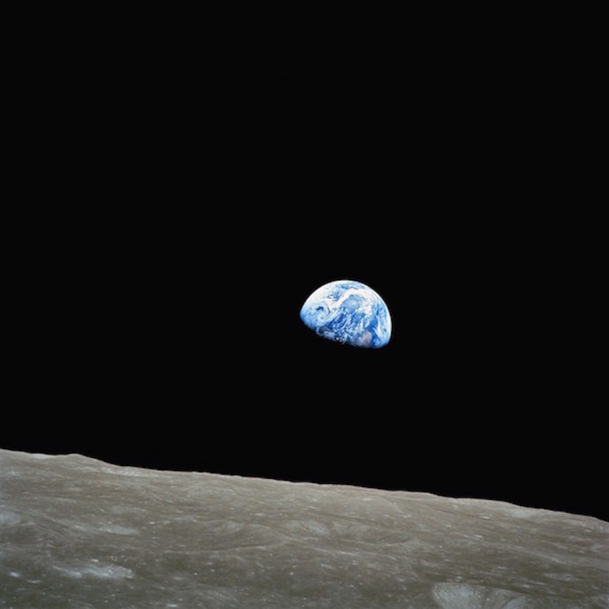
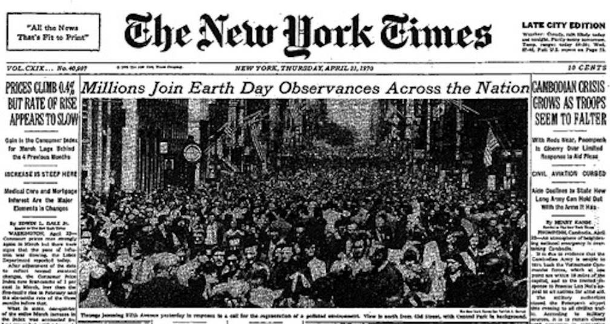
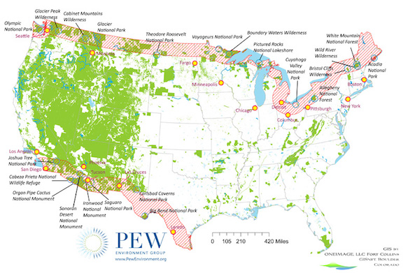

## Policy Eras

* _Progressive Era_: 1890 to 1915

* _Ecology_: 1950's and 1960's

* _The Environmental Movement and the Environmental Decade_: 1970's

* _Backlash_: 1980's through today

* [Major Environmental Laws](http://www2.epa.gov/laws-regulations/laws-and-executive-orders)

---

### Progressive Era

* Prelude: 1800's

* _Urbanization_: movement from farms to cities created separation
  from nature 

* Industrial Revolution: 
    * Mechanization and mass production 
    * Energy requirements: 8 million horsepower in 1850 to 64 million
  in 1900 

* Overconsumption of natural resources 

* From wood to coal and oil 

---

* Stronger role for government 

* Preservation and Conservation 

* Major _Federal_ Action
    * 1872: Congress created Yellowstone National Park
    * 1902: Bureau of Reclamation: water resource management  
    * 1905: Forest Service
    * 1908: Grand Canyon national monument
    * 1916: National Park Service
    
---

### Ecology

* Prelude: 1930's and 1940's

* Conservation and Public Works
    * 1933: Tennessee Valley Authority
    * 1934: Taylor Grazing Act, _limit overgrazing_
    * 1931--1936: Construction of Hoover Dam
    * 1940: U.S. Fish and Wildlife Service
    * 1946: Bureau of Land Management

---

* _Ecology_: Nature is a system based on interdependence and
  stability 

* Rachel Carson and the publication of _Silent Spring_ in 1962
    * _I contend, furthermore, that we have allowed these chemicals to be
used with little or no advance investigation of their effect on soil,
water, wildlife, and man himself. Future generations are unlikely to
condone our lack of prudent concern for the integrity of the natural
world that supports all life_

---

* DDT: __d__ichloro__d__iphenyl__t__richloroethane

* The US banned the use of DDT as a pesticide in 1972, but it is still used in other parts of the world

* Trade--offs
    * Malaria
    * [WHO Statement](http://whqlibdoc.who.int/hq/2011/WHO_HTM_GMP_2011_eng.pdf): A review of studies found that "levels of exposure [are] below levels of concern for human health"

## The Environmental Decade: 1970's

---

---

---

* [Earth Day 1970 Special Report](https://www.youtube.com/playlist?list=PL3480E41AA956A42B)

---

### The Environmental Movement

* Social movement

* Distrust of established institutions

* Large--scale change through law; "nationalization" of
  environmental legislation 

* Expansion of "rights" 
    * _Clean air, clean water, open spaces --- these should be the
    birthright for every American_ (President Nixon)

---
reading 
---

### Major Laws in the Environmental Decade

* 1970: 
    * National Environmental Policy Act (NEPA)
    * Clean Air Act Amendments

* 1972: 
    * Clean Water Act
    * Federal Environmental Pesticides Control Act
    * Marine Protection, Research, and Sanctuaries
    * Marine Mammal Protection Act
    * Coastal Zone Management 

* 1973: Endangered Species Act

* 1974: Safe Drinking Water Act

* 1976:
    * Resource Conservation and Recovery Act
    * Toxic Substances Control Act
    * Federal Land Policy Management Act
    * National Forest Management Act

* 1977:
    * Clean Air Act Amendments
    * Clean Water Act Amendments
    * Surface Mining Control and Reclamation Act

---

### Backlash

* Antienvironmental Activism in the late 1970's and 1980's

* Sagebrush Rebellion
    * _Western states wanted more state and local control of federally owned land for grazing, off--road vehicle use, and other uses_
    * [US News and World Report, 1980](http://www2.vcdh.virginia.edu/PVCC/mbase/docs/sagebrush.html)

---

---

* From Consensus to Polarization: The 1980's

* _The Reagan Revolution_ 
    * Energy crisis and stagflation 
    * Environmental protection at odds with economic growth 
    * Budgetary cutbacks in environmental agencies 
    * Regulatory reform 
        *[Executive Order 12291](http://www.presidency.ucsb.edu/ws/?pid=43424)
        * _Regulatory action shall not be undertaken unless the potential benefits to society from the regulation outweigh the potential costs to society_

---

#### Major Federal Laws in the 1980's

* 1980: Comprehensive Environmental Response, Compensation, and
  Liability Act (Superfund)

* 1982: Nuclear Waste Policy Act 

* 1984: Resource Conservation and Recovery Act Amendments

* 1986:
    * Safe Drinking Water Act Amendments
    * Superfund Amendments and Reauthorization Act 

* 1987: 
    * Clear Water Amendments Act
    * Nuclear Waste Policy Amendments

* 1988: Ocean Dumping Act

* 1990: Clean Air Amendments Act
    * _Contained the Acid Rain Program an emissions trading market to reduce emissions of sulfur dioxide and nitrogen oxides_

---

#### The 1990's

* The Wise Use movement
    * Open all public lands to mineral and energy production, particularly the Arctic National Wildlife Refuge (ANWR) 
    * Allow motorized trail travel and limited commercial development within the majority of federal land
    * [Ron Arnold Essay](http://www.cdfe.org/center-projects/wise-use/)

* The Property Rights movement
    * Property rights are paramount and property owners should be compensated, through eminent domain, if regulation devalues land
    * Many lawsuits have been filed, but no "decisive judicial shift" 

---

#### The 2000's

* George W. Bush 
    * Weakened regulatory enforcement through extensive review of proposed regulations 
    * Energy Policy Act of 2005 provided tax incentives and loan guarantees for energy production 
    * Withdrew from international discussions regarding climate change 
    * Science and politics 
        * [UCS Survey of Government Scientists 2005--2007](http://www.ucsusa.org/assets/documents/scientific_integrity/Voices_of_Federal_Scientists.pdf) 
        * _60% of scientists "personally  experienced at least one incident of political interference in their work over the last five years"_ 

---

### Next Week

* Binder, Sarah A. 2015. ["The Dysfunctional Congress."](http://sarahbinder.weebly.com/uploads/3/1/8/8/31889891/binder_page_proof_arps_dysfunctional_congress.pdf) _Annual Review of Political Science_ 18.

* Kraft, E. Michael. 2013. "Environmental Policy in Congress", __Chapter 5__ in _Environmental Policy: New Directions for the 21st Century_. eds. Michael E. Kraft and Norman J. Vig. CQ Press, Washington D.C. 8th Ed., pgs. 109--134 on [OAKS](https://lms.cofc.edu/)

* Clean Air Act in Congress on [OAKS](https://lms.cofc.edu/)

* [History of the Clean Air Act](http://www.epa.gov/air/caa/amendments.html)

* [CQ Researcher: Air Pollution Conflict](http://library.cqpress.com/cqresearcher/document.php?id=cqresrre2003111400&type=hitlist&num=0)
